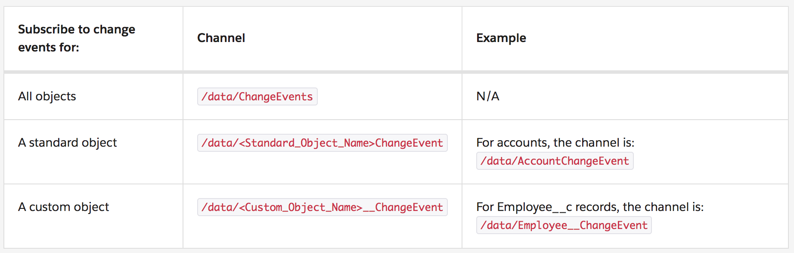

# Change Data Capture (CDC)

This GitHub Repo explains specifically for Change Data Capture (CDC). If you are looking for ALL Stremaning events then have a look at <a href="https://github.com/abrarsheikhsony/SFDC-streaming-api-events" target="_blank" alt="this detailed GitHub Repo">this detailed GitHub Repo</a>.

## Introduction
<ul>

<li>Starting with <a href="https://releasenotes.docs.salesforce.com/en-us/winter19/release-notes/rn_data_change_events.htm" target="_blank" alt="Winter '19 (API version 44.0) release">Winter '19 (API version 44.0) release</a>, Change Data Capture (CDC) was Developer Preview "or" Pilot feature.</li>

<li>Starting with <a href="https://releasenotes.docs.salesforce.com/en-us/spring19/release-notes/rn_data_change_events.htm" target="_blank" alt="Spring '19 (API version 45.0) release">Spring '19 (API version 45.0) release</a>, Change Data Capture (CDC) is Generally Available (GA).</li>

<li>Change Data Capture is a Streaming Event feature on the Lightning Platform.</li>

<li>Change Data Capture uses the Publisher/Subscriber model and Push technology.</li>

<li>Change Data Capture sends notifications to subscribers whenever a data change in Salesforce occurs.</li>

<li>Change Data Capture publishes events for changes in Salesforce records corresponding to <b>Create, Update, Delete, and Undelete operations.</b></li>

<li>You can receive changes of Salesforce records in real time and synchronize corresponding records in an external data store.</li>

</ul>

## When to Use Change Data Capture
<ul>
<li>Use Change Data Capture to update data in an external system instead of doing periodic exports or API polling.</li>
<li>Capturing changes with Change Data Capture event notifications ensures that your external data can be updated in real time and stays fresh.</li>
<li>You can use Change Data Capture as part of the data replication process.</li>
<li>Capture all field changes for all records.</li>
<li>Get broad access to all data regardless of sharing rules.</li>
<li>Get information about the change in the event header, such as the origin of the change, so you can ignore changes that your client generates.</li>
<li>Perform data updates using transaction boundaries when more than one operation is part of the same transaction.</li>
<li>Use a versioned event schema.</li>
<li>Subscribe to mass changes in a scalable way.</li>
<li>Get access to retained events for up to 3 days.</li>
</ul>

## Supported Objects
<ul>
<li>Custom Objects</li>
<li>Subset of <a href="https://developer.salesforce.com/docs/atlas.en-us.218.0.change_data_capture.meta/change_data_capture/cdc_object_support.htm" target="_blank" alt="Standard Objects">Standard Objects</a></li>
</ul>

## Sample Change Event JSON
<ul>
<li>

```
{
	"schema":"TIOb-jG_qRb2ucSBIdByMA",
	"payload":{
		"ChangeEventHeader":{
			"entityName":"Employee__c",
			"recordIds":[
				"a00xx0000004GvqAAE"
			],
			"changeType":"CREATE",
			"changeOrigin":"com/salesforce/api/soap/44.0;client=GetCloudy",
			"transactionKey":"00059b44-a6c7-ffa7-af68-8a455868ed30",
			"sequenceNumber":1,
			"isTransactionEnd":true,
			"commitTimestamp":1533160499000,
			"commitUser":"005xx000001SwSiAAK",
			"commitNumber":356619267
		},
		"First_Name__c":"Jane",
		"Last_Name__c":"Smith",
		"Name":"e-100",
		"Tenure__c":2.0,     
		"LastModifiedDate":"2018-08-01T21:54:58Z",
		"OwnerId":"005xx000001SwSiAAK",
		"CreatedById":"005xx000001SwSiAAK",
		"CreatedDate":"2018-08-01T21:54:58Z",
		"LastModifiedById":"005xx000001SwSiAAK",
	},
	"event":{
		"replayId":1
	}
}
```
</li>

<li>changeType: CREATE, UPDATE, DELETE, UNDELETE</li>
<li>changeOrigin: Use this field to detect whether your app initiated the change, so you do not process the change again and potentially avoid a deep cycle of changes. This field contains the Salesforce API and the API client ID that initiated the change, if set by the client.</li>
<li>Note: In the example, it is com/salesforce/api/soap/44.0;client=GetCloudy, which means that an app with clientID GetCloudy created the Employee record via SOAP API.</li>
<li>The order of the fields in the JSON event message follows the underlying <b>Avro schema</b> that Change Events are based on.</li>

</ul>

## Subscribe to an Event Channel using a Lightning Component
<ul>
<li>Reference from the <a href="https://developer.salesforce.com/docs/atlas.en-us.218.0.api_streaming.meta/api_streaming/code_sample_lightning_cmp.htm" target="_blank" alt="Streaming API Developer Guide">Streaming API Developer Guide</a>.</li>
<li>The <a href="https://developer.salesforce.com/docs/component-library/bundle/lightning:empApi/documentation" target="_blank" alt="lightning:empApi component">lightning:empApi component</a> uses a shared CometD-based Streaming API connection, enabling you to run multiple streaming apps in the browser.</li>
<li>To call the component’s methods, add the lightning:empApi component inside your custom component and assign an aura:id
attribute to it.</li>
<li></li>
<li>Then in the client-side controller, add functions to call the component methods.</li>
</ul>

## Subscription Channels
Reference from the <a href="https://trailhead.salesforce.com/content/learn/modules/change-data-capture/learn-change-data-capture-characteristics" target="_blank" alt="Trailhead: Learn Change Data Capture Characteristics">Trailhead: Learn Change Data Capture Characteristics</a>.


## Field-Level Security
Change Data Capture respects org’s field-level security settings. Delivered events contain only the fields that a subscribed user is allowed to view. 

## Required User Permissions
<ul>
<li>
Reference from the <a href="https://trailhead.salesforce.com/content/learn/modules/change-data-capture/learn-change-data-capture-characteristics" target="_blank" alt="Trailhead: Learn Change Data Capture Characteristics">Trailhead: Learn Change Data Capture Characteristics</a>.

</li>
<li>User permissions are enforced when the user subscribes to a channel. If the user has insufficient permissions, the user can’t subscribe to the channel and an error is returned.</li>
</ul>

## Change Event Objects in Metadata API
Developers can use the <b>PlatformEventChannel</b> metadata type in Metadata API to retrieve and deploy Change Data Capture objects.


## Fields in JSON & Apex Change Event Body
<a href="https://developer.salesforce.com/docs/atlas.en-us.218.0.change_data_capture.meta/change_data_capture/cdc_event_fields_body.htm" target="_blank" alt="Change Event Body Fields">Change Event Body Fields</a>

## 1 - Subscribe to Change Events with the CometD
CometD (A messaging library that enables listening to events through long polling and simulates push technology).
<a href="https://developer.salesforce.com/docs/atlas.en-us.api_streaming.meta/api_streaming/code_sample_interactive_vfp_intro.htm" target="_blank" alt="Interactive Visualforce Page without Replay">Interactive Visualforce Page without Replay</a>

<ul>
<li>Change Data Capture in Setup </li>
<li>Subscribe to Channel: <b>/data/Employee__ChangeEvent</b></li>

<li>
<b>Create</b> a New Employee__c record


```
{  
	"schema":"YBKiola5arQ6oq4jvUZpqQ",
	"payload":{
		"ChangeEventHeader":{ 
			"isTransactionEnd":true,
			"commitNumber":145933457551,
			"commitUser":"0051t000001pGyuAAE",
			"sequenceNumber":1,
			"entityName":"Employee__c",
			"changeType":"CREATE",
			"changeOrigin":"",
			"transactionKey":"000a5ce4-e172-f003-7f8b-65985f51ff5d",
			"commitTimestamp":1546275148000,
			"recordIds":[  
				"a011t00000AVBK2AAP"
			]
		},
		"Name":"EN-0002",
		"First_Name__c":"Marc",
		"Last_Name__c":"Benioff",
		"Tenure__c":18,
		"OwnerId":"0051t000001pGyuAAE",
		"CreatedById":"0051t000001pGyuAAE",
		"CreatedDate":"2018-12-31T16:52:28Z",
		"LastModifiedById":"0051t000001pGyuAAE",
		"LastModifiedDate":"2018-12-31T16:52:28Z"
	},
	"event":{
		"replayId":8894
	}
}
```
</li>

<li>
<b>Update</b> an Employee__c record


```
{  
	"schema":"YBKiola5arQ6oq4jvUZpqQ",
	"payload":{  
		"ChangeEventHeader":{
			"isTransactionEnd":true,
			"commitNumber":145934245284,
			"commitUser":"0051t000001pGyuAAE",
			"sequenceNumber":1,
			"entityName":"Employee__c",
			"changeType":"UPDATE",
			"changeOrigin":"",
			"transactionKey":"000a5f02-5bf7-616a-4920-372d508adce8",
			"commitTimestamp":1546275285000,
			"recordIds":[  
				"a011t00000AVBK2AAP"
			]
		},
		"First_Name__c":"Mr. Marc",
		"LastModifiedDate":"2018-12-31T16:54:45Z"
	},
	"event":{  
		"replayId":8895
	}
}
```
</li>

<li>
<b>Delete</b> an Employee__c record


```
{  
	"schema":"YBKiola5arQ6oq4jvUZpqQ",
	"payload":{  
		"ChangeEventHeader":{  
			"isTransactionEnd":true,
			"commitNumber":145934692846,
			"commitUser":"0051t000001pGyuAAE",
			"sequenceNumber":1,
			"entityName":"Employee__c",
			"changeType":"DELETE",
			"changeOrigin":"",
			"transactionKey":"000a5f1a-8a73-4106-4cdf-4233054ab64d",
			"commitTimestamp":1546275362000,
			"recordIds":[  
				"a011t00000AVBK2AAP"
			]
		}
	},
	"event":{  
		"replayId":8896
	}
}
```
</li>

<li>
Deleted record in Recycle Bin

</li>

<li>
<b>Undelete</b> an Employee__c record


```
{  
	"schema":"YBKiola5arQ6oq4jvUZpqQ",
	"payload":{
		"ChangeEventHeader":{
			"isTransactionEnd":true,
			"commitNumber":145935131858,
			"commitUser":"0051t000001pGyuAAE",
			"sequenceNumber":1,
			"entityName":"Employee__c",
			"changeType":"UNDELETE",
			"changeOrigin":"",
			"transactionKey":"000a5f2d-acde-66fe-94f2-142c3479e6d8",
			"commitTimestamp":1546275440000,
			"recordIds":[  
				"a011t00000AVBK2AAP"
			]
		},
		"Name":"EN-0002",
		"First_Name__c":"Mr. Marc",
		"Last_Name__c":"Benioff",
		"Tenure__c":18,
		"OwnerId":"0051t000001pGyuAAE",
		"CreatedById":"0051t000001pGyuAAE",
		"CreatedDate":"2018-12-31T16:52:28Z",
		"LastModifiedById":"0051t000001pGyuAAE",
		"LastModifiedDate":"2018-12-31T16:57:20Z"
	},
	"event":{  
		"replayId":8898
	}
}
```
</li>

</ul>

## 2 - Subscribe to Change Events with the EMP Connector
EMP Connector is an open-source sample tool that subscribes to streaming channels using Streaming API and CometD. EMP Connector is a thin wrapper around the CometD library and is implemented in Java.
<ul>
<li><a href="https://trailhead.salesforce.com/content/learn/modules/change-data-capture/subscribe-to-events" target="_blank" alt="Subscribe Using EMP Connector Sample 1">Subscribe Using EMP Connector Sample 1</a></li>
<li><a href="https://developer.salesforce.com/docs/atlas.en-us.218.0.change_data_capture.meta/change_data_capture/cdc_subscribe_emp_connector.htm" target="_blank" alt="Subscribe Using EMP Connector Sample 2">Subscribe Using EMP Connector Sample 2</a></li>
</ul>

## 3 - Subscribe to Change Events with the Apex Triggers (Developer Preview)
<ul>
<li>Starting with Spring '19 (API version 45.0) release, you can <a href="https://developer.salesforce.com/docs/atlas.en-us.218.0.change_data_capture.meta/change_data_capture/cdc_subscribe_apex_triggers.htm" target="_blank" alt="Subscribe with Apex Triggers (Developer Preview)">Subscribe to Change Events with Apex Triggers (Developer Preview)</a></li>
<li>Apex triggers for change events are similar to Apex triggers on platform events.</li>
<li>Change event triggers run asynchronously after the database transaction is completed.</li>
<li>Perform resource-intensive business logic asynchronously in the change event trigger, and implement transaction-based logic in the Apex object trigger.</li>
<li>By decoupling the processing of changes, change event triggers can help reduce transaction processing time.</li>
<li></li>
<li></li>
</ul>

## Useful Resources
<ul>

<li><a href="https://success.salesforce.com/_ui/core/chatter/groups/GroupProfilePage?g=0F93A000000HTvs" target="_blank" alt="Partner Community Group: Change Data Capture">Partner Community Group: Change Data Capture</a></li>

<li><a href="https://trailhead.salesforce.com/content/learn/modules/change-data-capture" target="_blank" alt="Trailhead: Change Data Capture Basics">Trailhead: Change Data Capture Basics</a></li>

<li><a href="https://developer.salesforce.com/docs/atlas.en-us.218.0.change_data_capture.meta/change_data_capture/cdc_intro.htm" target="_blank" alt="Change Data Capture Developer Guide">Change Data Capture Developer Guide</a></li>

<li><a href="https://developer.salesforce.com/blogs/2018/08/what-is-change-data-capture.html" target="_blank" alt="Salesforce Blog: What is Change Data Capture?">Salesforce Blog: What is Change Data Capture?</a></li>

<li><a href="https://www.youtube.com/watch?v=JEQZhZYZYPg" target="_blank" alt="YouTube: Change Data Capture -Not Your Average Data Synchronization">YouTube: Change Data Capture -Not Your Average Data Synchronization</a></li>

<li><a href="https://www.youtube.com/watch?v=v_hQyUZzLsA" target="_blank" alt="YouTube: Change Data Capture: Data Synchronization in the Cloud">YouTube: Change Data Capture: Data Synchronization in the Cloud</a></li>

<li><a href="https://www.salesforce.com/video/1111054/" target="_blank" alt="Salesforce Video: Change Data Capture: Not Your Average Data Synchronization">Salesforce Video: Change Data Capture: Not Your Average Data Synchronization</a></li>

<li><a href="https://www.salesforce.com/video/1778488/" target="_blank" alt="Salesforce Video: Why Subscribing To Change Data Capture Event Is Better Than Polling For Data">Salesforce Video: Why Subscribing To Change Data Capture Event Is Better Than Polling For Data</a></li>

<li><a href="https://mohan-chinnappan-n.github.io/sfdc/cdc.html#/home" target="_blank" alt="GitHub: Salesforce Change Data Capture">GitHub: Salesforce Change Data Capture</a></li>

</ul>
