# Change Data Capture (CDC)

This GitHub Repo explains specifically for Change Data Capture (CDC). If you are looking for ALL Streaming events then have a look at <a href="https://github.com/abrarsheikhsony/SFDC-streaming-api-events" target="_blank" alt="this detailed GitHub Repo">this detailed GitHub Repo</a>.

## Introduction
<ul>

<li>Starting with <a href="https://releasenotes.docs.salesforce.com/en-us/winter19/release-notes/rn_data_change_events.htm" target="_blank" alt="Winter '19 (API version 44.0) release">Winter '19 (API version 44.0) release</a>, Change Data Capture (CDC) was Developer Preview "or" Pilot feature.</li>

<li>Starting with <a href="https://releasenotes.docs.salesforce.com/en-us/spring19/release-notes/rn_data_change_events.htm" target="_blank" alt="Spring '19 (API version 45.0) release">Spring '19 (API version 45.0) release</a>, Change Data Capture (CDC) is Generally Available (GA).</li>

<li>Change Data Capture is a Streaming Event feature on the Lightning Platform.</li>

<li>Change Data Capture uses the Publisher/Subscriber model and Push technology.</li>

<li>Change Data Capture sends notifications to subscribers whenever a data change in Salesforce occurs.</li>

<li>Change Data Capture publishes events for changes in Salesforce records corresponding to <b>Create, Update, Delete, and Undelete operations.</b></li>

<li>You can receive changes of Salesforce records in real time and synchronize corresponding records in an external data store.</li>

</ul>

## When to Use Change Data Capture
<ul>
<li>Use Change Data Capture to update data in an external system instead of doing periodic exports or API polling.</li>
<li>Capturing changes with Change Data Capture event notifications ensures that your external data can be updated in real time and stays fresh.</li>
<li>You can use Change Data Capture as part of the data replication process.</li>
<li>Capture all field changes for all records.</li>
<li>Get broad access to all data regardless of sharing rules.</li>
<li>Get information about the change in the event header, such as the origin of the change, so you can ignore changes that your client generates.</li>
<li>Perform data updates using transaction boundaries when more than one operation is part of the same transaction.</li>
<li>Use a versioned event schema.</li>
<li>Subscribe to mass changes in a scalable way.</li>
<li>Get access to retained events for up to 3 days.</li>
<li><a href="https://developer.salesforce.com/docs/atlas.en-us.218.0.change_data_capture.meta/change_data_capture/cdc_select_objects.htm" target="_blank" alt="You can select up to 5 entities">You can select up to 5 entities</a>, including standard and custom objects.</li>
<li>To enable more entities, contact Salesforce to purchase an add-on license.</li>
<li>The add-on license removes the limit on the number of entities you can select. Also, it increases the CometD event delivery allocation.</li>
</ul>

## Supported Objects
<ul>
<li>Custom Objects</li>
<li>Subset of <a href="https://developer.salesforce.com/docs/atlas.en-us.218.0.change_data_capture.meta/change_data_capture/cdc_object_support.htm" target="_blank" alt="Standard Objects">Standard Objects</a></li>
</ul>

## Sample Change Event JSON
<ul>
<li>

```
{
  "data": {
    "schema": "YBKiola5arQ6oq4jvUZpqQ",
    "payload": {
      "LastModifiedDate": "2019-03-07T21:58:32Z",
      "OwnerId": "0051t000001pGyuAAE",
      "CreatedById": "0051t000001pGyuAAE",
      "ChangeEventHeader": {
        "isTransactionEnd": true,
        "commitNumber": 184824347392,
        "commitUser": "0051t000001pGyuAAE",
        "sequenceNumber": 1,
        "entityName": "Employee__c",
        "changeType": "CREATE",
        "changeOrigin": "com/salesforce/api/soap/45.0;client=SfdcInternalAPI/",
        "transactionKey": "001eb1e9-d14a-6cc0-617e-22108b39f4a5",
        "commitTimestamp": 1551995912000,
        "recordIds": [
          "a011t00000EEKg3AAH"
        ]
      },
      "CreatedDate": "2019-03-07T21:58:32Z",
      "First_Name__c": "Marc",
      "LastModifiedById": "0051t000001pGyuAAE",
      "Tenure__c": 20,
      "Name": "EN-0090",
      "Last_Name__c": "Benioff"
    },
    "event": {
      "replayId": 34754
    }
  },
  "channel": "/data/Employee__ChangeEvent"
}
```
</li>

<li>changeType: "CREATE", "UPDATE", "DELETE", "UNDELETE", "GAP_CREATE", "GAP_UPDATE", "GAP_DELETE", "GAP_UNDELETE", "GAP_OVERFLOW"</li>
<li>changeOrigin: Use this field to detect whether your app initiated the change, so you do not process the change again and potentially avoid a deep cycle of changes. This field contains the Salesforce API and the API client ID that initiated the change, if set by the client.</li>
<li>Note: In the example, it is com/salesforce/api/soap/44.0;client=GetCloudy, which means that an app with clientID GetCloudy created the Employee record via SOAP API.</li>
<li>The order of the fields in the JSON event message follows the underlying <b>Avro schema</b> that Change Events are based on.</li>
<li>
<a href="https://developer.salesforce.com/docs/atlas.en-us.218.0.change_data_capture.meta/change_data_capture/cdc_event_fields_header.htm" target="_blank" alt="Change Event Header Fields">Change Event Header Fields</a>

<ul>
<li>For gap events, the change type starts with the GAP_ prefix.</li>
<li>GAP_CREATE</li>
<li>GAP_UPDATE</li>
<li>GAP_DELETE</li>
<li>GAP_UNDELETE</li>
<li>For overflow events, the change type is GAP_OVERFLOW.</li>
</ul>

</li>

</ul>

## Change Event Schema by Event Name
<ul>
<li><a href="https://developer.salesforce.com/docs/atlas.en-us.218.0.change_data_capture.meta/change_data_capture/cdc_message_structure.htm" target="_blank" alt="Change Event Message Structure">Change Event Message Structure</a></li>
</li>Make a GET request to this resource:

```
/services/data/vXX.X/sobjects/<EventName>/eventSchema?payloadFormat=COMPACT

/services/data/v45.0/sobjects/Employee__ChangeEvent/eventSchema?payloadFormat=EXPANDED
```
</li>
</ul>

## Change Event Schema by Schema ID
<ul>
<li><a href="https://developer.salesforce.com/docs/atlas.en-us.218.0.change_data_capture.meta/change_data_capture/cdc_message_structure.htm" target="_blank" alt="Change Event Message Structure">Change Event Message Structure</a></li>
</li>Make a GET request to this resource:

```
/services/data/vXX.X/event/eventSchema/<Schema_ID>?payloadFormat=COMPACT

/services/data/v45.0/event/eventSchema/ABCiola5arQ6oq4jvUZpqQ?payloadFormat=COMPACT
```
</li>
</ul>

## Subscription Channels
Reference from the <a href="https://trailhead.salesforce.com/content/learn/modules/change-data-capture/learn-change-data-capture-characteristics" target="_blank" alt="Trailhead: Learn Change Data Capture Characteristics">Trailhead: Learn Change Data Capture Characteristics</a>.
<table>
  <tr>
    <th>Subscribe to change events for:</th>
    <th>Channel</th>
    <th>Example</th>
  </tr>
  <tr>
    <td>All Change Events (all objects)</td>
    <td>/data/ChangeEvents</td>
    <td></td>
  </tr>


  <tr>
    <td>Standard Object</td>
    <td>/data/StandardObjectNameChangeEvent</td>
    <td>/data/AccountChangeEvent</td>
  </tr>

  <tr>
    <td>Custom Object</td>
    <td>/data/CustomObjectName__ChangeEvent</td>
    <td>/data/Employee__ChangeEvent</td>
  </tr>

  <tr>
    <td>Custom Channel</td>
    <td>/data/YourChannelName__chn</td>
    <td>/data/SalesEvents__chn</td>
  </tr>
</table>

## Field-Level Security
Change Data Capture respects org’s field-level security settings. Delivered events contain only the fields that a subscribed user is allowed to view. 

## Required User Permissions
<ul>
<li>
Reference from the <a href="https://trailhead.salesforce.com/content/learn/modules/change-data-capture/learn-change-data-capture-characteristics" target="_blank" alt="Trailhead: Learn Change Data Capture Characteristics">Trailhead: Learn Change Data Capture Characteristics</a>.
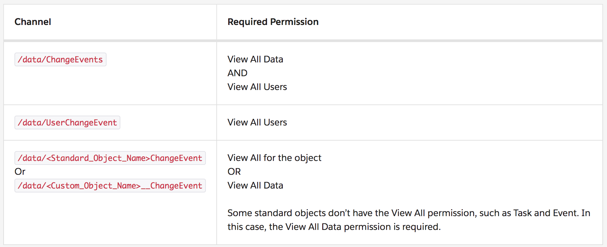
</li>
<li>User permissions are enforced when the user subscribes to a channel. If the user has insufficient permissions, the user can’t subscribe to the channel and an error is returned.</li>
</ul>

## Change Event Objects in Metadata API
Developers can use the <b>PlatformEventChannel</b> metadata type in Metadata API to retrieve and deploy Change Data Capture objects.
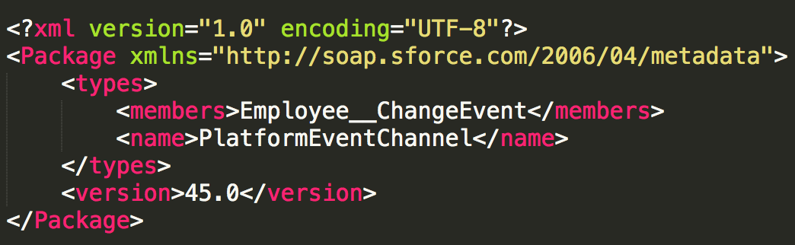
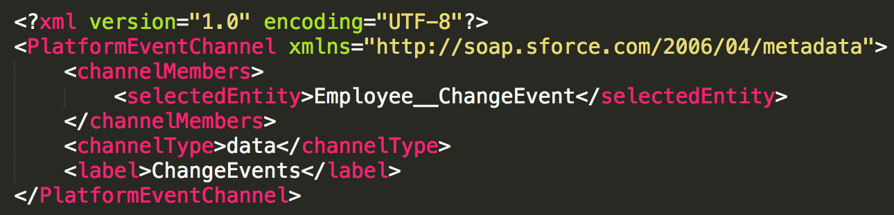

## Fields in JSON & Apex Change Event Body
<a href="https://developer.salesforce.com/docs/atlas.en-us.218.0.change_data_capture.meta/change_data_capture/cdc_event_fields_body.htm" target="_blank" alt="Change Event Body Fields">Change Event Body Fields</a>

## 1 - Subscribe to Change Events with the CometD
CometD (A messaging library that enables listening to events through long polling and simulates push technology).

<a href="https://developer.salesforce.com/docs/atlas.en-us.api_streaming.meta/api_streaming/code_sample_interactive_vfp_intro.htm" target="_blank" alt="Interactive Visualforce Page without Replay">Interactive Visualforce Page without Replay</a>

<a href="https://help.salesforce.com/articleView?id=external_object_change_tracking_example_streaming_api.htm&type=5" target="_blank" alt="Subscribe to Changes with the Streaming API">Subscribe to Changes with the Streaming API</a>

<ul>
<li>Change Data Capture in Setup 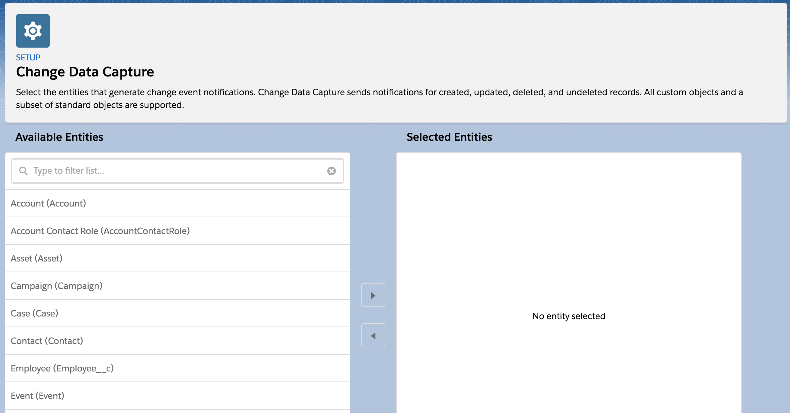</li>
<li><b>Note:</b> Here, the filter is case-sensitive. Make sure that you use the same case as the entity.</li>

<li>Subscribe to Channel: <b>/data/Employee__ChangeEvent</b></li>

<li>
<b>Create</b> a New Employee__c record
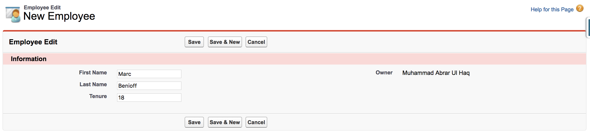

```
{
  "data": {
    "schema": "YBKiola5arQ6oq4jvUZpqQ",
    "payload": {
      "LastModifiedDate": "2019-03-07T21:58:32Z",
      "OwnerId": "0051t000001pGyuAAE",
      "CreatedById": "0051t000001pGyuAAE",
      "ChangeEventHeader": {
        "isTransactionEnd": true,
        "commitNumber": 184824347392,
        "commitUser": "0051t000001pGyuAAE",
        "sequenceNumber": 1,
        "entityName": "Employee__c",
        "changeType": "CREATE",
        "changeOrigin": "com/salesforce/api/soap/45.0;client=SfdcInternalAPI/",
        "transactionKey": "001eb1e9-d14a-6cc0-617e-22108b39f4a5",
        "commitTimestamp": 1551995912000,
        "recordIds": [
          "a011t00000EEKg3AAH"
        ]
      },
      "CreatedDate": "2019-03-07T21:58:32Z",
      "First_Name__c": "Marc",
      "LastModifiedById": "0051t000001pGyuAAE",
      "Tenure__c": 20,
      "Name": "EN-0090",
      "Last_Name__c": "Benioff"
    },
    "event": {
      "replayId": 34754
    }
  },
  "channel": "/data/Employee__ChangeEvent"
}
```
</li>

<li>
<b>Update</b> an Employee__c record
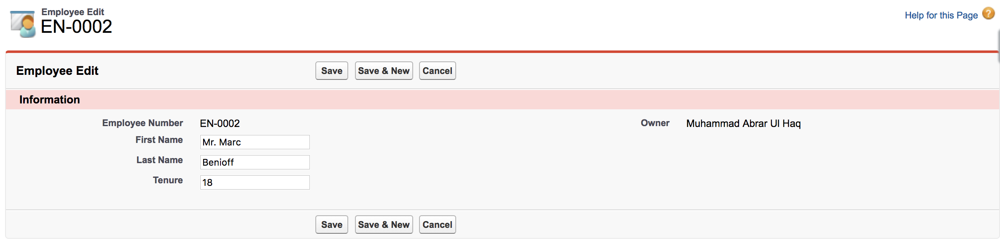

```
{
  "data": {
    "schema": "YBKiola5arQ6oq4jvUZpqQ",
    "payload": {
      "LastModifiedDate": "2019-03-07T21:59:41Z",
      "ChangeEventHeader": {
        "isTransactionEnd": true,
        "commitNumber": 184824755535,
        "commitUser": "0051t000001pGyuAAE",
        "sequenceNumber": 1,
        "entityName": "Employee__c",
        "changeType": "UPDATE",
        "changeOrigin": "com/salesforce/api/soap/45.0;client=SfdcInternalAPI/",
        "transactionKey": "001eb1f9-c921-2fd7-bdd4-19fad459c18f",
        "commitTimestamp": 1551995981000,
        "recordIds": [
          "a011t00000EEKg3AAH"
        ]
      },
      "First_Name__c": "Marc2",
      "Tenure__c": 22,
      "Last_Name__c": "Benioff2"
    },
    "event": {
      "replayId": 34755
    }
  },
  "channel": "/data/Employee__ChangeEvent"
}
```
</li>

<li>
<b>Delete</b> an Employee__c record
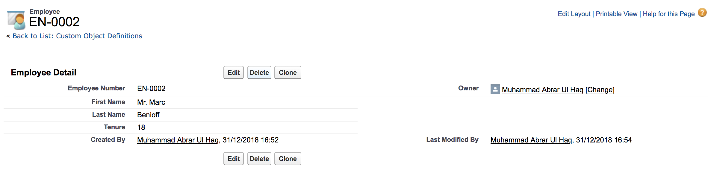

```
{
  "data": {
    "schema": "YBKiola5arQ6oq4jvUZpqQ",
    "payload": {
      "ChangeEventHeader": {
        "isTransactionEnd": true,
        "commitNumber": 184825371580,
        "commitUser": "0051t000001pGyuAAE",
        "sequenceNumber": 1,
        "entityName": "Employee__c",
        "changeType": "DELETE",
        "changeOrigin": "com/salesforce/api/soap/45.0;client=SfdcInternalAPI/",
        "transactionKey": "001eb20b-9af7-899e-b710-2f0a0e470043",
        "commitTimestamp": 1551996058000,
        "recordIds": [
          "a011t00000EEKg3AAH"
        ]
      }
    },
    "event": {
      "replayId": 34768
    }
  },
  "channel": "/data/Employee__ChangeEvent"
}
```
</li>

<li>
Deleted record in Recycle Bin
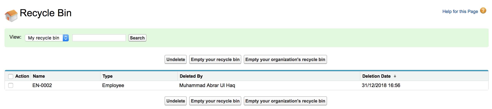
</li>

<li>
<b>Undelete</b> an Employee__c record
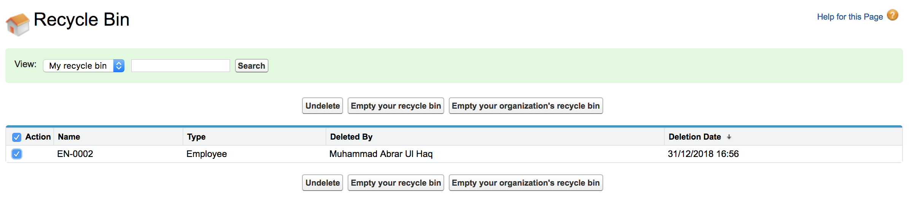
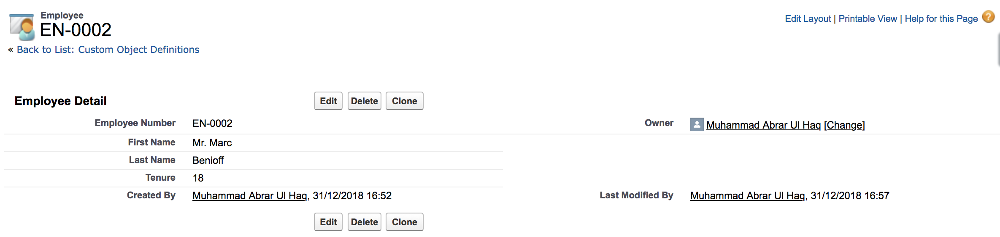

```
{  
	"schema":"YBKiola5arQ6oq4jvUZpqQ",
	"payload":{
		"ChangeEventHeader":{
			"isTransactionEnd":true,
			"commitNumber":145935131858,
			"commitUser":"0051t000001pGyuAAE",
			"sequenceNumber":1,
			"entityName":"Employee__c",
			"changeType":"UNDELETE",
			"changeOrigin":"",
			"transactionKey":"000a5f2d-acde-66fe-94f2-142c3479e6d8",
			"commitTimestamp":1546275440000,
			"recordIds":[  
				"a011t00000AVBK2AAP"
			]
		},
		"Name":"EN-0002",
		"First_Name__c":"Mr. Marc",
		"Last_Name__c":"Benioff",
		"Tenure__c":18,
		"OwnerId":"0051t000001pGyuAAE",
		"CreatedById":"0051t000001pGyuAAE",
		"CreatedDate":"2018-12-31T16:52:28Z",
		"LastModifiedById":"0051t000001pGyuAAE",
		"LastModifiedDate":"2018-12-31T16:57:20Z"
	},
	"event":{  
		"replayId":8898
	}
}
```
</li>

</ul>

## 2 - Subscribe to Change Events with the EMP Connector
Enterprise Messaging Platform (EMP) Connector is an open-source sample tool that subscribes to streaming channels using Streaming API and CometD. EMP Connector is a thin wrapper around the CometD library. It hides the complexity of creating a CometD client and subscribing to Streaming API in Java.

<ul>
<li><a href="https://trailhead.salesforce.com/content/learn/modules/change-data-capture/subscribe-to-events" target="_blank" alt="Subscribe Using EMP Connector Sample 1">Subscribe Using EMP Connector Sample 1</a></li>
<li><a href="https://developer.salesforce.com/docs/atlas.en-us.218.0.change_data_capture.meta/change_data_capture/cdc_subscribe_emp_connector.htm" target="_blank" alt="Subscribe Using EMP Connector Sample 2">Subscribe Using EMP Connector Sample 2</a></li>
</ul>

## 3 - Subscribe to Change Events with a Lightning Component
<ul>
<li>Reference from the <a href="https://developer.salesforce.com/docs/atlas.en-us.218.0.api_streaming.meta/api_streaming/code_sample_lightning_cmp.htm" target="_blank" alt="Streaming API Developer Guide">Streaming API Developer Guide</a>.</li>
<li>The <a href="https://developer.salesforce.com/docs/component-library/bundle/lightning:empApi/documentation" target="_blank" alt="lightning:empApi component">lightning:empApi component</a> uses a shared CometD-based Streaming API connection, enabling you to run multiple streaming apps in the browser.</li>
<li>To call the component’s methods, add the lightning:empApi component inside your custom component and assign an aura:id
attribute to it.</li>
<li>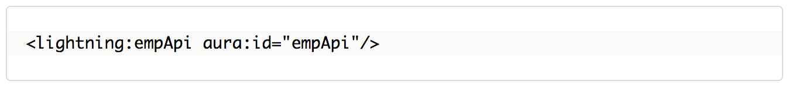</li>
<li>Then in the client-side controller, add functions to call the component methods.</li>
</ul>

## 4 - Subscribe to Change Events with a Lightning Web Component (LWC)
<ul>
<li>Starting with Summer '19 release, you can subscribe to an event channel using the <a href="https://releasenotes.docs.salesforce.com/en-us/summer19/release-notes/rn_platform_event_lwc_empapi.htm" target="_blank" alt="lightning/empApi module">lightning/empApi module</a></li>
<li>The events that you can receive include platform events, PushTopic events, generic events, and Change Data Capture events.</li>
</ul>

## 5 - Subscribe to Change Events with the Apex Triggers (Developer Preview)
<ul>
<li>You can <a href="https://releasenotes.docs.salesforce.com/en-us/summer19/release-notes/rn_change_event_triggers.htm" target="_blank" alt="Process Change Event Messages in Apex Triggers">Process Change Event Messages in Apex Triggers</a></li>
<li>Apex triggers for change events are similar to Apex triggers on platform events.</li>
<li>Change event triggers run asynchronously after the database transaction is completed.</li>
<li>Perform resource-intensive business logic asynchronously in the change event trigger, and implement transaction-based logic in the Apex object trigger.</li>
<li>By decoupling the processing of changes, change event triggers can help reduce transaction processing time.</li>
</ul>

## 5.1 - Understanding of Change Event Triggers
<ul>
<li><a href="https://developer.salesforce.com/docs/atlas.en-us.218.0.change_data_capture.meta/change_data_capture/cdc_trigger_intro.htm" target="_blank" alt="Understanding of Change Event Triggers">Understanding of Change Event Triggers</a></li>
<li>Is an after-insert trigger (defined with the after insert keyword).</li>
<li>Debug logs corresponding to the trigger execution are created by Automated Process.</li>
<li>The system fields of records that the trigger processes, such as CreatedById and LastModifiedById, also reference the Automated Process entity.</li>
<li>Executes asynchronously outside the Apex transaction that published the change event.</li>
<li>Is subject to Apex synchronous governor limits.</li>
<li>Any type of change event fires a change event trigger, including gap events and overflow events.</li>
</ul>

## 5.2 - Sample example of Change Event Triggers
<ul>

<li><a href="https://developer.salesforce.com/docs/atlas.en-us.218.0.change_data_capture.meta/change_data_capture/cdc_trigger_quick_start.htm" target="_blank" alt="Apex Trigger Quick Start and Example">Apex Trigger Quick Start and Example</a></li>

<li><a href="https://help.salesforce.com/articleView?id=external_object_change_tracking_example_create_triggers.htm&type=5" target="_blank" alt="Salesforce Documentation: React to Changes with Apex Triggers">Salesforce Documentation: React to Changes with Apex Triggers</a></li>

</ul>

## 5.3 - Change Event Trigger Considerations
<ul>
<li>You can't test Apex change event triggers using <a href="https://developer.salesforce.com/docs/atlas.en-us.218.0.change_data_capture.meta/change_data_capture/cdc_general_considerations.htm" target="_blank" alt="Apex tests">Apex tests</a>.</li>
<li>You also can't <a href="https://developer.salesforce.com/docs/atlas.en-us.218.0.change_data_capture.meta/change_data_capture/cdc_general_considerations.htm" target="_blank" alt="package">package</a> change event triggers.</li>
<li><a href="https://developer.salesforce.com/docs/atlas.en-us.218.0.change_data_capture.meta/change_data_capture/cdc_general_considerations.htm" target="_blank" alt="Formula fields">Formula fields </a> aren't included in change events.</li>
</ul>

## 6 - Gap and Overflow Events
<ul>

<li><a href="https://developer.salesforce.com/docs/atlas.en-us.218.0.change_data_capture.meta/change_data_capture/cdc_other_events.htm" target="_blank" alt="Other Types of Change Events: Gap and Overflow Events">Other Types of Change Events: Gap and Overflow Events</a></li>

</ul>

## 7 - Subscribe to a Custom (Virtual) Channel
<ul>
<li>Starting with Summer '19 release, you can now subscribe to <a href="https://releasenotes.docs.salesforce.com/en-us/summer19/release-notes/rn_change_data_capture_custom_channels.htm" target="_blank" alt="Custom Channels">Custom Channels</a> to receive specific types of events (e.g. Account, Contact, Employee__c etc.).</li>
<li>You can track changes made to the External Object from within Salesforce and changes made outside of Salesforce are tracked.</li>
</ul>

## 8 - External Change Data Capture
<ul>
<li>Starting with Summer '19 release, <a href="https://releasenotes.docs.salesforce.com/en-us/summer19/release-notes/rn_forcecom_external_data_change_capture_ga.htm" target="_blank" alt="External Change Data Capture">External Change Data Capture</a> is now Generally Available (GA) in Salesforce Connect using the OData 4.0 adapter.</li>
<li>You can create a custom channel with <a href="https://developer.salesforce.com/docs/atlas.en-us.220.0.change_data_capture.meta/change_data_capture/cdc_custom_channel.htm" target="_blank" alt="Metadata API">Metadata API</a>. You can’t create or view custom channels in Setup in the Change Data Capture page.</li>
<li>/data/YourChannelName__chn = /data/SalesEvents__chn</li>
</ul>

## Transaction-based Replication Approach
<ul>

<li>To maintain an accurate replica of your org’s data in another system, subscribe using a <a href="https://developer.salesforce.com/docs/atlas.en-us.218.0.change_data_capture.meta/change_data_capture/cdc_replication_steps.htm" target="_blank" alt="transaction-based approach">transaction-based approach</a>.</li>

</ul>

## Change Data Capture Allocations
<ul>

<li><a href="https://developer.salesforce.com/docs/atlas.en-us.change_data_capture.meta/change_data_capture/cdc_allocations.htm" target="_blank" alt="Change Data Capture Allocations">Change Data Capture Allocations</a>.</li>

</ul>

## Useful Resources
<ul>

<li><a href="https://success.salesforce.com/_ui/core/chatter/groups/GroupProfilePage?g=0F93A000000HTvs" target="_blank" alt="Partner Community Group: Change Data Capture">Partner Community Group: Change Data Capture</a></li>

<li><a href="https://trailhead.salesforce.com/content/learn/modules/change-data-capture" target="_blank" alt="Trailhead: Change Data Capture Basics">Trailhead: Change Data Capture Basics</a></li>

<li><a href="https://developer.salesforce.com/docs/atlas.en-us.218.0.change_data_capture.meta/change_data_capture/cdc_intro.htm" target="_blank" alt="Change Data Capture Developer Guide">Change Data Capture Developer Guide</a></li>

<li><a href="https://developer.salesforce.com/blogs/2018/08/what-is-change-data-capture.html" target="_blank" alt="Salesforce Blog: What is Change Data Capture?">Salesforce Blog: What is Change Data Capture?</a></li>

<li><a href="https://www.youtube.com/watch?v=JEQZhZYZYPg" target="_blank" alt="YouTube: Change Data Capture -Not Your Average Data Synchronization">YouTube: Change Data Capture -Not Your Average Data Synchronization</a></li>

<li><a href="https://www.youtube.com/watch?v=v_hQyUZzLsA" target="_blank" alt="YouTube: Change Data Capture: Data Synchronization in the Cloud">YouTube: Change Data Capture: Data Synchronization in the Cloud</a></li>

<li><a href="https://www.salesforce.com/video/1111054/" target="_blank" alt="Salesforce Video: Change Data Capture: Not Your Average Data Synchronization">Salesforce Video: Change Data Capture: Not Your Average Data Synchronization</a></li>

<li><a href="https://www.salesforce.com/video/1778488/" target="_blank" alt="Salesforce Video: Why Subscribing To Change Data Capture Event Is Better Than Polling For Data">Salesforce Video: Why Subscribing To Change Data Capture Event Is Better Than Polling For Data</a></li>

<li><a href="https://blog.texei.com/get-live-notifications-when-the-record-youre-viewing-gets-modified-58c71cfddc0b" target="_blank" alt="Blog: Get live notifications when the record you’re viewing gets modified">Blog: Get live notifications when the record you’re viewing gets modified</a></li>

<li><a href="http://sfdcfacts.com/platform/change-data-capture-events-in-salesforce-keep-your-ui-updated-with-latest-data/" target="_blank" alt="Blog: Keep your UI updated with latest data">Blog: Keep your UI updated with latest data</a></li>

<li><a href="http://sfdcfacts.com/lightning/lightningempapi-winter19-capture-streaming-events/" target="_blank" alt="Blog: lightning:empApi #Winter19 – Capture Streaming Events">Blog: lightning:empApi #Winter19 – Capture Streaming Events</a></li>

<li><a href="http://bobbuzzard.blogspot.com/2018/08/lightning-emp-api-in-winter-19.html" target="_blank" alt="Blog: Emp API in Winter 19">Blog: Emp API in Winter 19</a></li>

<li><a href="http://simpluslabs.com/how-to-use-platform-event-in-lightning-by-using-lightningempapi/" target="_blank" alt="Blog: How to use Platform Event in lightning by using lightning:empApi">Blog: How to use Platform Event in lightning by using lightning:empApi</a></li>

<li><a href="https://mohan-chinnappan-n.github.io/sfdc/cdc.html#/home" target="_blank" alt="GitHub: Salesforce Change Data Capture">GitHub: Salesforce Change Data Capture</a></li>

<li><a href="https://github.com/parthiban019/lightning-empApi" target="_blank" alt="GitHub: lightning-empApi">GitHub: lightning-empApi</a></li>

</ul>
